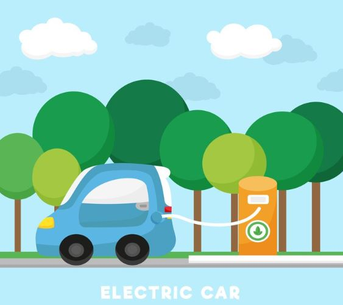
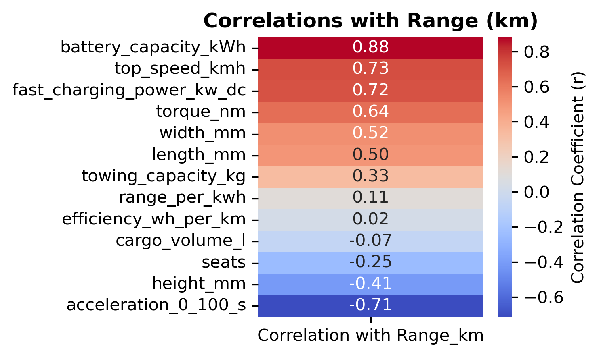
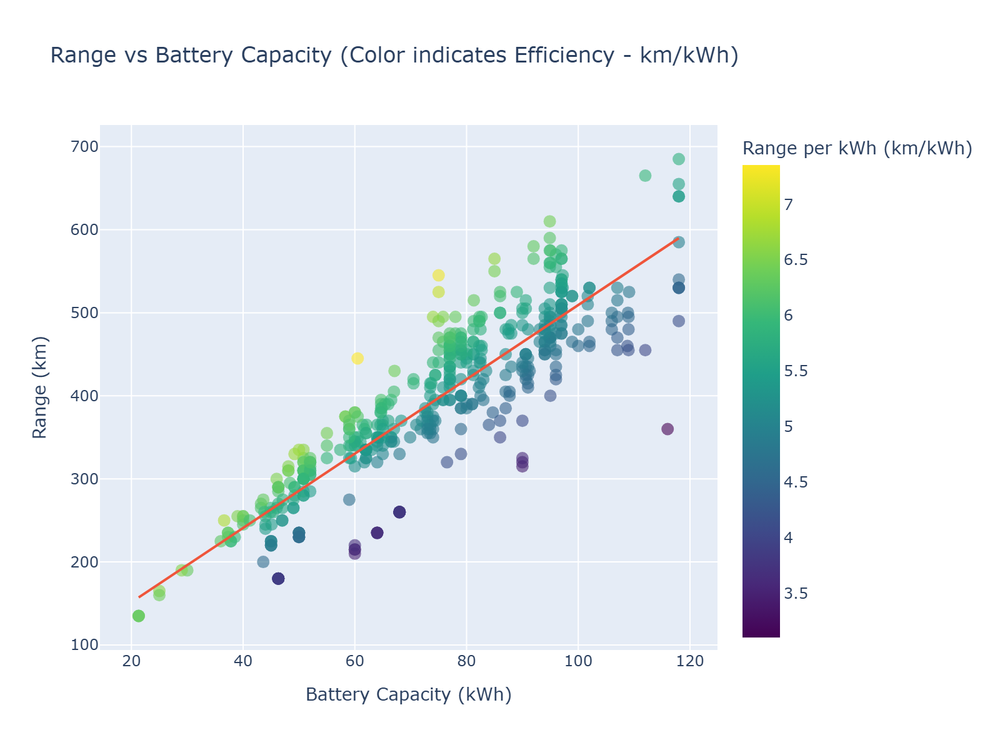

# EV Driving Range Prediction Capstone

Predicting electric vehicle (EV) driving range and identifying the key features that influence it using data analysis and machine learning.


## Table of Contents
1. [Project Overview](#project-overview)
2. [Dataset](#dataset)
3. [Workflow](#workflow)
4. [Visualizations](#visualizations)
5. [Machine Learning Models](#machine-learning-models)
6. [How to Run](#how-to-run)
7. [Results](#results)
8. [Conclusion](#conclusion)

## Project Overview
This capstone project aims to analyze electric vehicle data to determine which features most affect driving range and to build predictive models to estimate range. The project covers the full data science workflow, from data cleaning and exploratory analysis to feature engineering, visualization, and machine learning modeling.

## Dataset
The dataset includes specifications of various electric vehicles, with a focus on features that influence driving range:

- **Battery capacity (kWh)** – directly affects maximum driving range
- **Efficiency (Wh/km)** – energy consumption in watt-hours per kilometer; lower values indicate higher efficiency   
- **Top speed (km/h)** – higher speeds generally consume more energy  
- **Fast charging capability** – indicates battery and charging performance  
- **Other performance and design features** – e.g., motor type, drivetrain  

Data cleaning and preprocessing steps were applied to ensure quality and consistency.

The full dataset can be accessed [here](https://www.kaggle.com/datasets/urvishahir/electric-vehicle-specifications-dataset-2025).

## Workflow
The project follows an **end-to-end data science pipeline**:
- Data import and preparation
- Idempotence checks to ensure reproducibility
- Exploratory Data Analysis (EDA)
- Descriptive statistics
- Data cleaning
- Graphical analysis (static & interactive charts using Plotly)
- Correlation analysis and feature importance
- Machine learning modeling:
  - Linear Regression
  - Random Forest Regression
  - K-Nearest Neighbors (KNN)
- Model evaluation using R², MAE, and MSE

## Visualizations
Sample visualizations from the project:

**Correlation Heatmap**



**Top Features Influencing EV Range**  


**Interactive Plot Example (Plotly)**  


For the interactive version, click [here](images/range_vs_battery_efficiency.html).

## Machine Learning Models
- **Linear Regression:** Baseline model to predict EV range  
- **Random Forest Regression:** Captures non-linear relationships for higher accuracy  
- **K-Nearest Neighbors Regression:** Alternative model for comparison  

Models were evaluated on training and testing sets using metrics such as R², Mean Absolute Error (MAE), and Mean Squared Error (MSE).

## How to Run
To reproduce the project locally:

1. Clone the repository:
   ```bash
   git clone https://github.com/yourusername/your-repo.git
Install required packages:

bash
Copy code
pip install -r requirements.txt
Open the Jupyter Notebook:

bash
Copy code
jupyter notebook notebook/your_notebook.ipynb
Run all cells in order.

Results
Identified the key features that most influence EV driving range.

Built predictive models that estimate range with good accuracy.

Visualizations provide insights into feature relationships and model performance.

Conclusion
This project demonstrates a complete data science workflow, from data preparation to machine learning modeling. Future enhancements could include testing advanced models, using larger or real-time datasets, or deploying a web application for EV range prediction.


