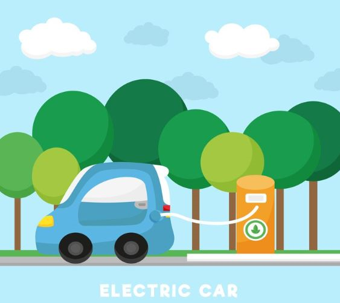
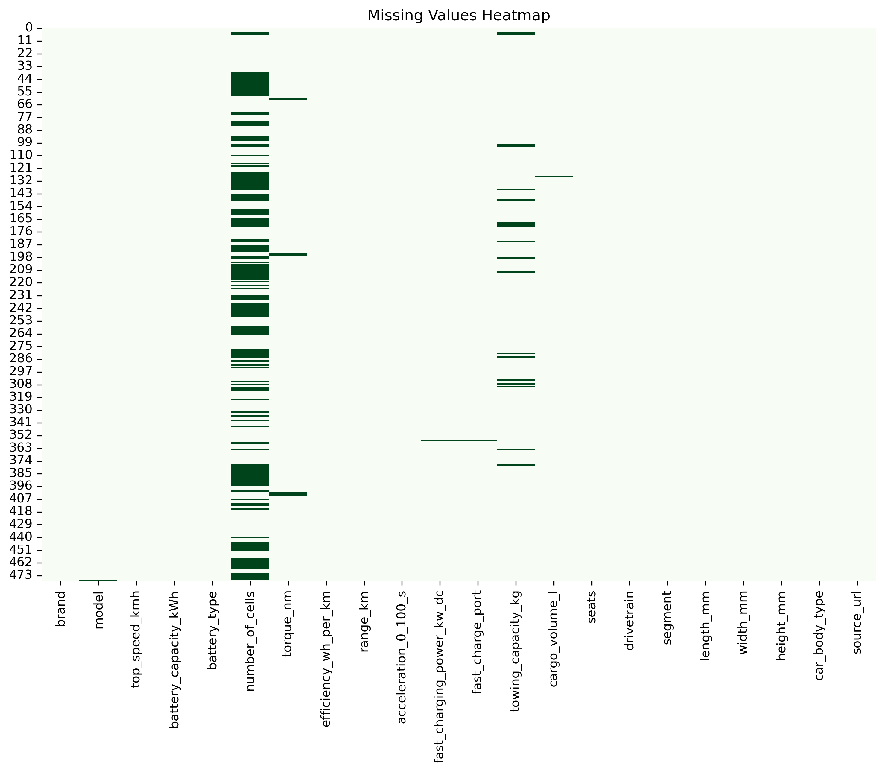
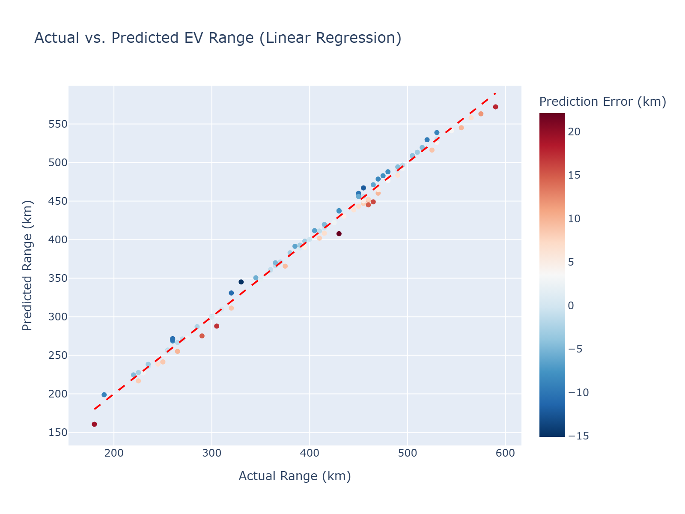

# EV Driving Range Prediction Capstone

<div align="left">
  
</div>

### Objective: 
To identify which features most influence the driving range and to build a predictive model to estimate range based on key features.

**Key Questions:**
1. Which factors (battery capacity, effeciency, acceleration, etc.) most affect EV range?
2. Can we predict the driving range of new EVs using these features?

---

## Table of Contents
1. [Project Overview](#project-overview)
2. [Dataset](#dataset)
3. [Workflow](#workflow)
4. [Visualizations](#visualizations)
5. [Machine Learning Models](#machine-learning-models)
6. [How to Run](#how-to-run)
7. [Results](#results)
8. [Conclusion](#conclusion)

---

## Project Overview

This capstone project aims to analyze electric vehicle data to determine which features most affect driving range and to build predictive models to estimate range. 

The project covers the full data science workflow, from data cleaning and exploratory analysis to feature engineering, visualization, and machine learning modeling.

---

## Dataset
The dataset includes specifications of various electric vehicles, with a focus on features that influence driving range:

- **Battery capacity (kWh)** – directly affects maximum driving range
- **Efficiency (Wh/km)** – energy consumption in watt-hours per kilometer; lower values indicate higher efficiency   
- **Top speed (km/h)** – higher speeds generally consume more energy  
- **Fast charging capability** – indicates battery and charging performance  
- **Other performance and design features** – e.g., motor type, drivetrain, acceleration, and dimensions  

Data cleaning and preprocessing steps were applied to ensure quality and consistency across all fields.

Dataset Source (Kaggle):
https://www.kaggle.com/datasets/urvishahir/electric-vehicle-specifications-dataset-2025

---

## Workflow
The project follows an **end-to-end data science pipeline**:

- Data import and preparation
- Idempotence checks to ensure reproducibility
- Exploratory Data Analysis (EDA)
- Descriptive statistics
- Data cleaning
- Graphical analysis (static plots with Matplotlib/Seaborn and interactive charts using Plotly)
- Correlation analysis and feature importance
- Machine learning modeling:
  - Linear Regression
  - Random Forest Regressor
  - K-Nearest Neighbors (KNN)
- Model evaluation using R², MAE, and MSE

---

## Visualizations

### Static Plots
**Missing Values Heatmap**  
<div align="left">
  
</div>

**Correlation Heatmap**  
<div align="left">
  
</div>

### Interactive Plotly Chart

Interactive charts are saved as HTML files. Click the links below to explore them in your browser.

**Range Distribution by Drivetrain**
<div align="left">
  
</div>
<a href="https://Jeszl0201.github.io/ev-range-analysis/range_distribution_by_drivetrain.html" target="_blank">View Interactive Chart</a>

👆 (Open link in new tab)

**Range vs Battery Capacity (Efficiency indicated by color)**
<div align="left">
  
</div>
<a href="https://Jeszl0201.github.io/ev-range-analysis/range_vs_battery_efficiency.html" target="_blank">View Interactive Chart</a>

👆 (Open link in new tab)

---

## Machine Learning Models
- **Linear Regression** – baseline model for range prediction  
- **Random Forest Regressor** – handles non-linear relationships and interactions  
- **K-Nearest Neighbors** – captures local patterns in the dataset   

Models were evaluated on training and testing sets using metrics such as **R²**, **Mean Absolute Error (MAE)**, and **Mean Squared Error (MSE)**. Feature importance analysis was also performed to identify the key contributors to driving range.

---

## How to Run

To reproduce the project locally:

1. **Clone the repository:**
```bash
git clone https://github.com/Jeszl0201/ev-range-analysis.git
```

2. Install required packages:

```bash
cd ev-range-analysis
pip install -r requirements.txt
```

3. Open the Jupyter Notebook:

```bash
jupyter notebook notebook/Electric_Car_Specs_2025_GitHub.ipynb
```

4. Run all cells in order to reproduce the analysis, plots, and results.

5. Optional: Interactive Plotly charts are saved as HTML files in the images folder. Open them in a browser to explore interactivity.

## Results
- Identified the key features that most influence EV driving range.
- Built predictive models that estimate range with good accuracy.
- Visualizations provide insights into feature relationships and model performance.

## Conclusion
This project demonstrates a complete data science workflow, from data preparation and exploratory analysis to machine learning modeling for EV range prediction. The Linear Regression model achieved a near-perfect predictive accuracy (𝐑² = 0.99), confirming that EV range is overwhelmingly a deterministic and predictable metric based on vehicle specifications. 

**Actual vs Predicted EV Range**
<div align="left">
  
</div>
<a href="https://Jeszl0201.github.io/ev-range-analysis/actual_vs_predicted_ev_range_linear_regression.html" target="_blank">View Interactive Chart</a>

👆 (Open link in new tab)

Both numeric features (e.g., battery capacity, weight, efficiency metrics) and categorical features (e.g., drivetrain, vehicle type) were analyzed to understand their impact on EV range. For instance, drivetrain plays a notable role: AWD vehicles generally have a lower typical range compared to FWD or RWD due to increased weight and energy consumption.

Interestingly, exploratory analysis suggested that features like vehicle model and brand influence EV range. However, in predictive modeling, excluding these categorical features improved the model’s R² score, likely due to high cardinality and added noise. Conversely, features like efficiency, which showed low correlation individually, were critical for model performance, highlighting the difference between descriptive trends and predictive importance.

Future enhancements could include:

- Testing advanced machine learning models or ensemble techniques.
- Incorporating larger or real-time datasets for improved accuracy.
- Exploring more sophisticated encoding and interaction effects for categorical features.
- Deploying a web application for interactive EV range predictions and visualization.

Overall, this project provides a solid foundation for both insights into EV range determinants and predictive modeling, highlighting the importance of considering both numeric and categorical factors.


